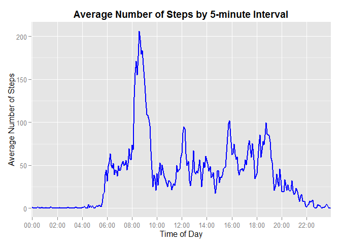

# Reproducible Research: Peer Assessment 1


The code in this document require installation of packages `dplyr` and `ggplot2`.


```r
library(dplyr)
```

```
## 
## Attaching package: 'dplyr'
## 
## The following object is masked from 'package:stats':
## 
##     filter
## 
## The following objects are masked from 'package:base':
## 
##     intersect, setdiff, setequal, union
```

```r
library(ggplot2)
```

```
## Warning: package 'ggplot2' was built under R version 3.1.3
```

## Loading and preprocessing the data

Reading the data from the file **activity.zip** :

```r
data <- read.csv(unz("activity.zip", "activity.csv"))
```

Structure of the data frame _data_:

```r
str(data)
```

```
## 'data.frame':	17568 obs. of  3 variables:
##  $ steps   : int  NA NA NA NA NA NA NA NA NA NA ...
##  $ date    : Factor w/ 61 levels "2012-10-01","2012-10-02",..: 1 1 1 1 1 1 1 1 1 1 ...
##  $ interval: int  0 5 10 15 20 25 30 35 40 45 ...
```

Looking into data, we can see the presence of missing values coded as `NA` in variable _steps_. Also, _interval_ variable contains integer values 1 to 4 digit. 
For farther analysis and creating plots, it is more convenient to have _interval_ values 
in time format `hh:mm`.

```r
data$interval <- sprintf("%04d", data$interval)
data$interval <- format(strptime(data$interval, format = "%H%M"), format = "%H:%M")
```
Now the structure of _interval_ variable is:

```r
str(data$interval)
```

```
##  chr [1:17568] "00:00" "00:05" "00:10" "00:15" "00:20" ...
```

## What is mean and median of total number of steps taken per day?

First, let's calculate the total number of steps taken per day.
We are going to ignore the missing values of steps `NA` excluding rows with missing
data from our dataset.

```r
daily_total_steps <- data %>% filter(!is.na(steps)) %>% group_by(date) %>%
    summarise_each(funs(sum), steps)
```

The following is a histogram of the total number of steps taken each day.

```r
# Adjusting parameter "binwidth" for geom_histogram()
breaks <- pretty(range(daily_total_steps$steps), n = nclass.FD(daily_total_steps$steps),
                 min.n = 1)
binwidth <- breaks[2] - breaks[1] 

# Creating a histogram
ggplot(data = daily_total_steps, aes(x = steps)) + 
    geom_histogram(binwidth = binwidth, color = "black", fill = "lightblue") +
    xlab("Steps per Day") + ylab("Number of Days") + 
    ggtitle("Total Number of Steps per Day") +
    theme(plot.title = element_text(face = "bold", vjust = 1))
```

 

Let's calculate the mean and median of the total number of steps per day.

```r
total_mean <- mean(daily_total_steps$steps)
total_median <- median(daily_total_steps$steps)
```

The mean of the total number of steps per day, rounded to the nearest hundredth, is 
10766.19 

and the median is 
10765.


## What is the average daily activity pattern?

Let's calculate the average number of steps for each 5-minute interval across all days.
Again, we are going to ignore observations with missing values of steps `NA` in our dataset.

```r
ave_interval_steps <- data %>% filter(!is.na(steps)) %>% group_by(interval) %>%
                      summarise_each(funs(mean), steps)
```

The following is a plot that shows a pattern in average daily activity:

```r
ggplot(ave_interval_steps, aes(x = interval, y = steps, group = 1)) + 
    geom_line(colour = "blue", size = 1) +
    scale_x_discrete(breaks = c("00:00", "02:00", "04:00", "06:00", "08:00", 
                         "10:00", "12:00", "14:00", "16:00", "18:00", "20:00", "22:00"),
                     labels = c("00:00", "02:00", "04:00", "06:00", "08:00", 
                         "10:00", "12:00", "14:00", "16:00", "18:00", "20:00", "22:00")) +
    xlab("Time of Day") + ylab("Average Number of Steps") +
    ggtitle("Average Number of Steps by 5-minute Interval") +
    theme(plot.title = element_text(face = "bold", vjust = 1))
```

 

We can calculate maximum average number of steps during a day.

```r
max_ave_steps <- max(ave_interval_steps$steps)
```

Rounded to the nearest hundredth, it is
206.17

Next, let's find the 5-minute interval that contains the maximum number of steps: 

```r
max_steps_observation <- ave_interval_steps %>% filter(steps == max_ave_steps)
max_steps_interval <- max_steps_observation$interval
```
The interval containing maximum number of steps is
08:35

## Imputing missing values

There are a number of days and intervals where there are missing values coded as `NA`.
The following is a code that calculates the total number of missing values 
in the dataset _data_.

```r
missing_values_num <- sum(is.na(data$steps))
```

According to our calculation, the total number of missing values is
2304

To fill in all of the missing values in the dataset,  we will replace every missing 
value of steps for each 5-minute interval during the day with the mean of steps for 
the same 5-minute interval accross all other days.

```r
data_imputed <- data %>% 
    mutate(steps = ifelse(is.na(steps)&data$interval==ave_interval_steps$interval, 
                          round(ave_interval_steps$steps), steps))
```
   
Thus, we created a new dataset *data_imputed* that is equal to the original dataset *data*
but with the missing data filled in.

Now, let's calculate the total number of steps per day and create a histogram 
of the total number of steps taken each day for new dataset without missing values.

```r
total_steps_imputed <- data_imputed %>% group_by(date) %>%
    summarise_each(funs(sum), steps)

ggplot(data = total_steps_imputed, aes(x = steps)) + 
    geom_histogram(binwidth = binwidth, color = "black", fill = "lightgreen") +
    xlab("Steps per Day") + ylab("Number of Days") + 
    ggtitle("Total Number of Steps per Day") +
    theme(plot.title = element_text(face = "bold", vjust = 1))
```

 

The mean and median of the total number of steps taken per day for new dataset 
can be calculated as follows: 

```r
total_mean_imputed <- mean(total_steps_imputed$steps)
total_median_imputed <- median(total_steps_imputed$steps)
```
Now the mean (rounded to the nearest hundredth) is
10765.64

and the median is
10762

Comparing the mean and median for both datasets, one with missing values that 
were ignored and one with missing values filled, we can see 
that missing-data imputation slightly decreased the mean and median.


## Are there differences in activity patterns between weekdays and weekends?

To answer this question, we need to create a new factor variable _day_ in the 
dataset *data_imputed* with two levels  "weekday" and "weekend" indicating 
whether a given date is a weekday or a day of weekend respectively.

```r
data_imputed$day <- as.factor(ifelse(weekdays(as.Date(data_imputed$date)) 
                                     %in% c("Saturday", "Sunday"),"weekend", "weekday"))
```

Next, we need to calculate the average number of steps for each 5-minute interval 
across all weekdays and weekends.

```r
ave_interval_steps_day <- data_imputed %>% group_by(day, interval) %>% 
                          summarise_each(funs(mean), steps)
```

The following is a plot that shows differences in activity patterns between 
weekdays and weekends.

```r
ggplot(ave_interval_steps_day, aes(x = interval, y = steps, group = 1)) +     
    geom_line(colour = "blue", size = 1) +
    scale_x_discrete(breaks = c("00:00", "02:00", "04:00", "06:00", "08:00", 
                         "10:00", "12:00", "14:00", "16:00", "18:00", "20:00", "22:00"),
                     labels = c("00:00", "02:00", "04:00", "06:00", "08:00", 
                         "10:00", "12:00", "14:00", "16:00", "18:00", "20:00", "22:00")) +
    facet_wrap(~ day, nrow = 2) +
    xlab("Time of Day") + ylab("Average Number of Steps") +
    ggtitle("Daily Activity Patterns for Weekdays and Weekends ") +
    theme(plot.title = element_text(face = "bold", vjust = 1))
```

 

Looking at the plot, we can clearly see that the level of activity during early morning, 
starting around 6am and especialy between 8am and 9am, on weekdays is obviously higher 
then on weekends. However, on weekends we can notice much higher then on weekdays 
activity during lunch time (around 12pm), afternoon - around 1pm, 2 pm and 4-5pm, and 
late evening - between 8pm and 9pm. 
